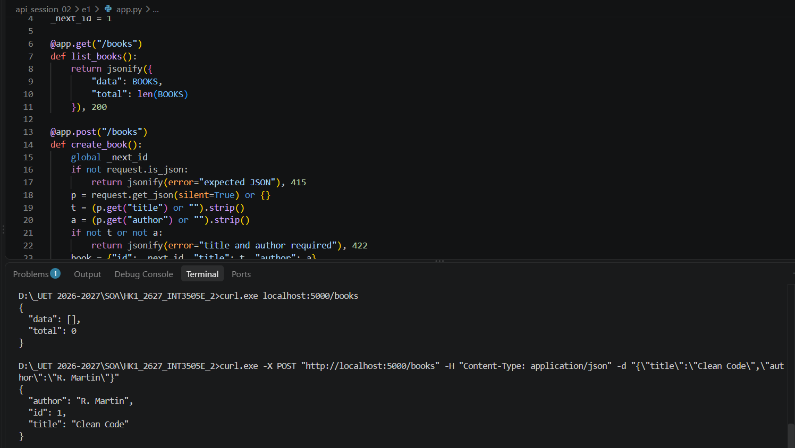
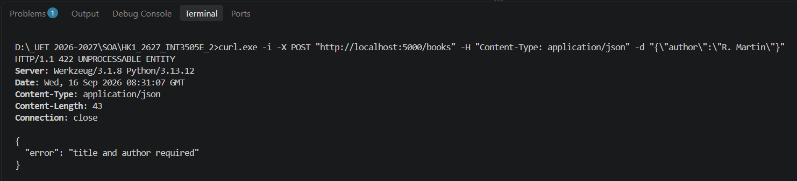
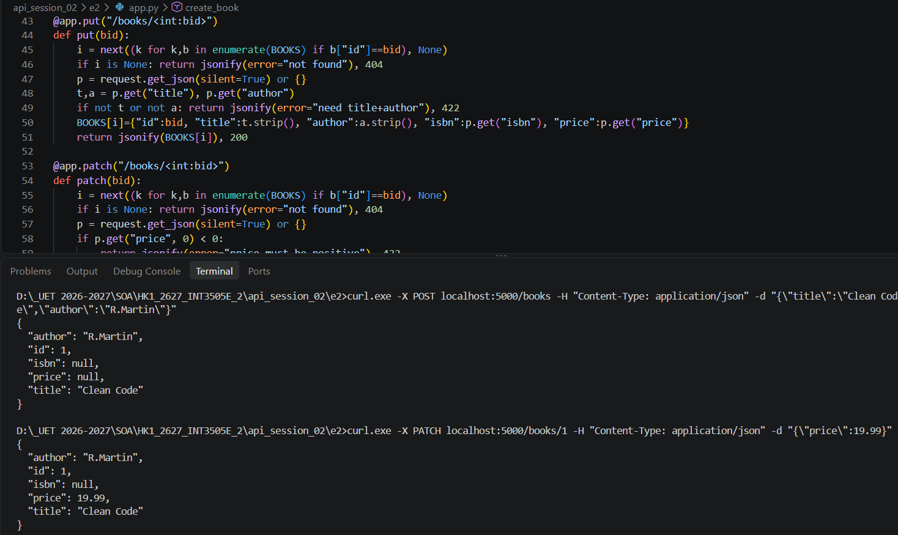
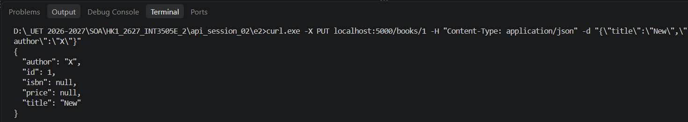
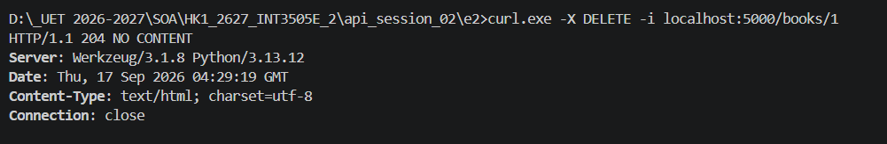
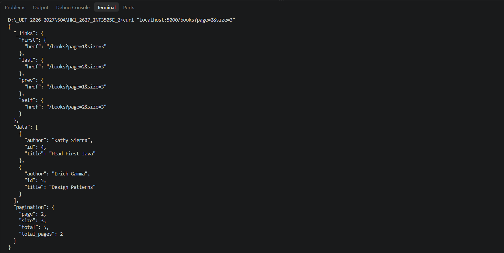
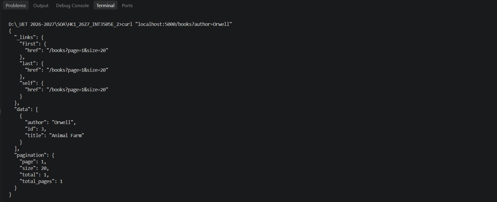
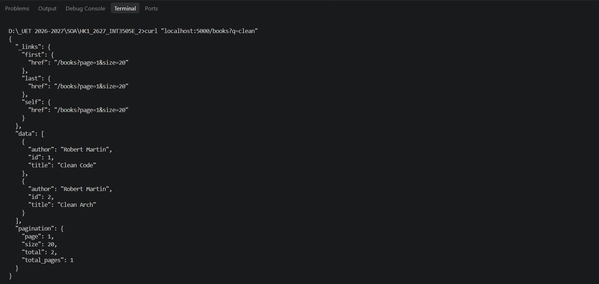
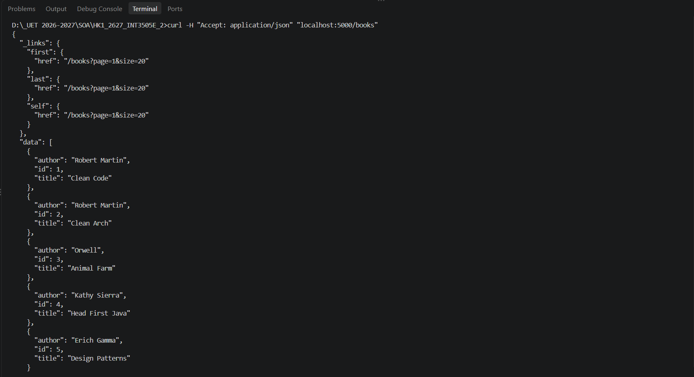
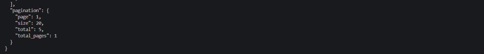

## Bài 1

  <em>Hình 1. GET danh sách books và POST tạo mới</em>

  <em>Hình 2. Test POST thiếu title</em>

## Bài 2

  <em>Hình 1. Đổi 1 field bằng PATCH</em>

  <em>Hình 2. Thay toàn bộ bằng PUT</em>

  <em>Hình 3. DELETE thành công trả về 204</em>

## Bài 3

  <em>Hình 1. Trang 2 với size=3 (sách 4-5)</em>

  <em>Hình 2. Tìm sách của tác giả Orwell</em>

  <em>Hình 3. Tìm sách có 'clean' trong tên</em>

  <em>Hình 4-5. Trả response định dạng JSON</em>

